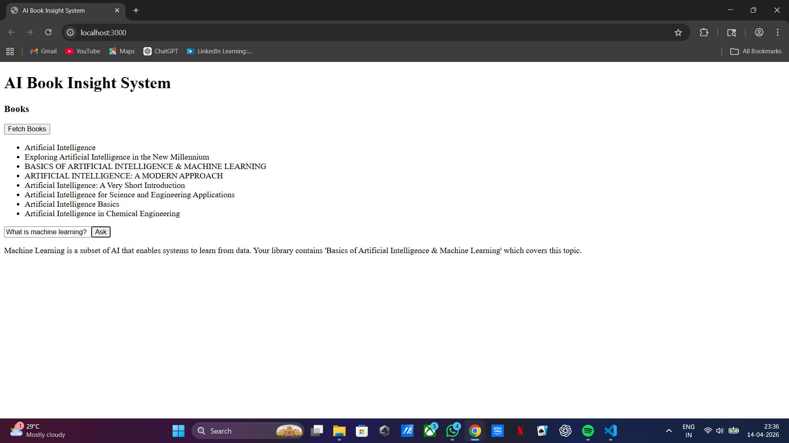

<<<<<<< HEAD
<<<<<<<
=======
>>>>>>>
=======
# 📚 BookMind AI – Intelligent Book Insight Platform

A full-stack AI-powered document intelligence platform that collects, processes, and analyzes book data using Retrieval-Augmented Generation (RAG). The system enables users to explore books, generate insights, and ask intelligent questions.

---

## 🚀 Features

* 📖 Automated book data collection (web scraping)
* 🧠 AI-powered insights:

  * Book summaries
  * Genre classification
  * Smart recommendations
* ❓ Question Answering using RAG pipeline
* 🔍 Semantic search using embeddings
* 🌐 REST APIs for all functionalities
* 💻 Interactive frontend UI

---

## 🏗️ Tech Stack

### Backend

* Python
* Django REST Framework
* MySQL (metadata storage)
* FAISS / ChromaDB (vector database)

### Frontend

* React.js / Next.js
* Tailwind CSS

### AI Integration

* OpenAI API / LM Studio (Local LLM)
* Sentence Transformers (for embeddings)

### Automation

* Selenium (for web scraping)

---

## ⚙️ System Architecture

1. Scrape book data from web sources
2. Store metadata in database
3. Generate embeddings from text
4. Store embeddings in vector database
5. User query → embedding → similarity search
6. Retrieve context → generate answer using LLM

---

## 🔗 API Endpoints

### 📥 GET APIs

* `GET /api/books/`
  List all books

* `GET /api/books/<id>/`
  Get detailed information about a book

* `GET /api/books/recommendations/`
  Get related book recommendations

---

### 📤 POST APIs

* `POST /api/books/upload/`
  Upload and process new books

* `POST /api/ask/`
  Ask questions about books (RAG-based)

#### Example Request:

```json
{
  "question": "What is this book about?"
}
```

---

## 🤖 AI Features Implemented

* ✅ Summary Generation
* ✅ Genre Classification
* ✅ Recommendation Logic
* ✅ Question Answering (RAG Pipeline)

---

## 🧠 RAG Pipeline

* Generate embeddings for user query
* Perform similarity search on stored book chunks
* Retrieve relevant context
* Generate answer using LLM

---

## 🖥️ Frontend Pages

### 📊 Dashboard

* Displays all books
* Shows title, author, description

### 📘 Book Detail Page

* Detailed view of selected book

### ❓ Q&A Interface

* User question input
* AI-generated answer output

---

## 🛠️ Setup Instructions

### 1. Clone Repository

```bash
git clone https://github.com/Ayushman-Singh-26/bookmind_ai.git
cd bookmind_ai
```

---

### 2. Backend Setup

```bash
cd backend
pip install -r requirements.txt
python manage.py migrate
python manage.py runserver
```

---

### 3. Frontend Setup

```bash
cd frontend
npm install
npm start
```

---

### 4. Environment Variables

Create a `.env` file:

```
OPENAI_API_KEY=your_api_key
```

---

## 📸 Screenshots

> Add your screenshots in a folder named `screenshots`

### Dashboard


### Book Detail Page


### Q&A Interface



---

## 💬 Sample Questions & Answers

**Q1: What is this book about?**
➡️ Generates a summary of the book

**Q2: Recommend similar books**
➡️ Suggests related books

**Q3: What genre is this book?**
➡️ Predicts genre using AI

---

## 📂 Project Structure

```
bookmind_ai/
├── backend/
├── frontend/
├── screenshots/
├── README.md
├── requirements.txt
```

---

## 🧪 Testing

* Upload sample books
* Test API endpoints using Postman
* Use Q&A interface for queries

---

## ✨ Bonus Features

* Efficient embedding-based search
* Scalable backend APIs
* Clean UI design
* Modular architecture

---

## 👨‍💻 Author

**Ayushman Singh**
GitHub: https://github.com/Ayushman-Singh-26

---

## ⭐ Final Note

This project demonstrates a complete full-stack AI application using RAG, combining backend APIs, frontend UI, and intelligent data processing.
>>>>>>> 2a75cb5a0e491ba6df21b02a023b649fbf0454dd
